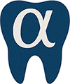

# AlphaDent

Repository for AlphaDent dataset. It contains links for dataset, train, validation and inference scripts for Yolo26.

## Dataset links

* Dataset on [zenodo](https://zenodo.org/records/16582489), [kaggle](https://www.kaggle.com/competitions/alpha-dent/data), [huggingface](https://huggingface.co/datasets/ZFTurbo/AlphaDent), [github](https://github.com/ZFTurbo/AlphaDent/releases/tag/v1.1)

## End-to-End Notebooks (canonical, Kaggle/Colab)

Three self-contained notebooks reproduce the paper *"Multi-Method Explainability for YOLO26-Based Caries Detection in Intra-oral Photos"*:

1. **[alphadent-yolo26.ipynb](alphadent-yolo26.ipynb)** — 9-class end-to-end: dataset setup, DDP training, self-healing validation, inference, and qualitative CAMs. Runs write to `runs/segment/`.
2. **[alphadent-yolo26-4class.ipynb](alphadent-yolo26-4class.ipynb)** — merged 4-class (Abrasion, Filling, Crown, Caries) end-to-end. Builds a **separate, non-destructive** `AlphaDent_4class/` dataset (9-class labels are never overwritten) and isolates its runs under `runs_4classes/segment/`.
3. **[alphadent-xai-eval.ipynb](alphadent-xai-eval.ipynb)** — quantitative XAI evaluation: causal deletion/insertion faithfulness AUC and inter-method agreement across the 7 CAM methods (produces the paper's faithfulness table and figures).

Shared features:
* **Automatic Dataset Setup**: Resolves Kaggle read-only input mount issues or downloads the Zenodo ZIP fallback.
* **Multi-GPU / DDP Training**: Dynamically configures distributed data parallel training across all available GPUs.
* **Self-Healing Validation**: Falls back to CPU validation on CUDA OOM for high-resolution dental images.
* **Explainable AI (XAI)**: A self-contained `YOLOExplainer` supporting 7 CAM methods — **Eigen-CAM**, **Grad-CAM**, **Grad-CAM++**, **XGrad-CAM**, **HiRes-CAM**, **Layer-CAM**, **EigenGrad-CAM** — using a localized-peak attribution target so the gradient-based methods stay distinct, plus an `nc` guard that refuses to score a wrong-class checkpoint.

> Older per-model and superseded scripts/notebooks have been moved to `trash/` (git-ignored).

## Train

* Download dataset and put in the folder with this code. Then fix path in `yolo_seg_train.yaml` if needed.
* Then you can train with following script:

```bash
python3 train26.py --dataset_config ./AlphaDent/yolo_seg_train.yaml --batch_size 16 --epochs 100 --image_size 640
```

Results of training will be stored in folder `./yolo_seg_x_proj_640`.

## Pretrained weights

There are 3 different pretrained wights available: 
1) Yolo_v8x, 9 classes and 640 input. Download: [Link](https://github.com/ZFTurbo/AlphaDent/releases/download/v1.0/yolov8x_AlphaDent_9_classes_640px.pt)
2) Yolo_v8x, 9 classes and 960 input. Download: [Link](https://github.com/ZFTurbo/AlphaDent/releases/download/v1.0/yolov8x_AlphaDent_9_classes_960px.pt)
3) Yolo_v8x, 4 classes and 960 input. Download: [Link](https://github.com/ZFTurbo/AlphaDent/releases/download/v1.0/yolov8x_AlphaDent_4_classes_960px.pt)


## Validation

Validation will run model with validation data and output metrics.

```bash
python3 valid26.py --weights './weights/yolo26x_AlphaDent_9_classes_640px.pt' --dataset_config './AlphaDent/yolo_seg_train.yaml' --batch_size 16 --epochs 100 --image_size 640
```

## Inference

If you have new dental photos for which you want to obtain predictions you can use inference script.

```bash
python3 inference26.py --weights './weights/yolo26x_AlphaDent_9_classes_640px.pt' --input